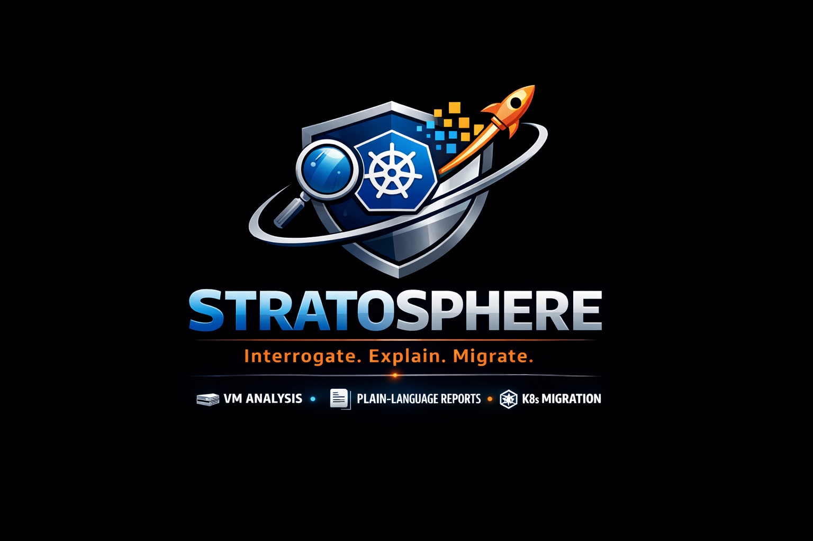

<p align="center">
  
</p>

# Stratosphere

**Interrogate the VM. Explain the system. Generate the migration plan.**

Stratosphere is a Kubernetes-first migration architect for legacy enterprise applications.
It observes how a VM actually behaves, explains what it found in plain language, and produces
a governed migration package engineers can review and deploy safely — without guessing.

---

## What it solves

Enterprise VMs accumulate years of undocumented runtime behavior. Modernizing them by hand
means weeks of interviews, stale wikis, and high-risk guesswork. Stratosphere replaces that
by capturing live runtime evidence, decomposing it into deployable workloads, and producing a
complete Kubernetes migration package with review and approval gates before anything changes.

---

## How it fits with existing tools

Cloud and vendor toolchains can already generate containers or migration assets for many stacks. Stratosphere is the layer that makes modernization usable and governable for teams who do not live in infrastructure every day:

- **Decision and communication first**: plain-language intake, current-state map, future-state options, and “what to validate next”.
- **Evidence-based recommendations**: confidence + unknowns + rationale for why something is a `Deployment`, `StatefulSet`, or `CronJob`.
- **Governance built-in**: review, approvals, preflight checks, and a blue/green cutover plan that change boards can audit.
- **Agent-accessible**: MCP tools let an enterprise Copilot/agent drive the workflow while keeping outputs deterministic and reviewable.

Stratosphere is not “click-to-migrate” in v1. It produces artifacts and an execution plan that humans (typically platform teams) deploy after sign-off.

---

## What you get

| Artifact | Description |
|---|---|
| `Dockerfile` per workload | Minimal, layered, ready-to-build |
| `helm/` chart | Values, templates, secrets scaffold |
| `terraform/` scaffold | Namespace, RBAC, storage provisioning |
| `reports/migration-summary.md` | Plain-language overview for stakeholders |
| `reports/executive-summary.md` | Decision-ready brief for app owners |
| `reports/readiness.{json,md}` | Readiness score, blockers, confidence |
| `reports/business-impact.{json,md}` | Customer, security, and effort translation |
| `reports/cutover-plan.{json,md}` | Blue/green stages and rollback triggers |
| `reports/secrets-management.md` | Detected secrets and injection guide |
| `reports/roi-estimate.{json,md}` | Cost and sustainment ROI model |
| `reports/application-map-*.md` | Current and future architecture maps |

---

## How to run it

**From a runtime snapshot file:**
```bash
npm run stratosphere -- \
  --runtime-file fixtures/stratosphere/sample-runtime.json \
  --out-dir artifacts/my-migration
```

**From SSH (live VM discovery):**
```bash
npm run stratosphere -- \
  --ssh-host 10.0.1.42 --ssh-user deploy \
  --intake-file my-intake.json \
  --out-dir artifacts/my-migration
```

**Guided wizard (no JSON prep needed):**
```bash
npm run stratosphere -- \
  --wizard \
  --runtime-file fixtures/stratosphere/sample-runtime.json \
  --out-dir artifacts/my-migration
```

---

## Ways to use it

**CLI** — Run `npm run stratosphere -- --help` for all flags. Accepts snapshot files, local
discovery, or live SSH. Optional: `--strategy`, `--intake-file`, `--workspace-file`,
`--export-provider`. See `docs/stratosphere/engineering/QUICKSTART.md`.

**MCP server** — Start with `npm run mcp:start`. Register as a local stdio server in any
MCP-compatible AI environment (Claude Desktop, Opencode, etc.) and call
`generate_migration_bundle` or `generate_local_vm_bundle` directly from chat.

**Opencode (on the target VM)** — Register Stratosphere as an MCP server in Opencode, then
call `generate_local_vm_bundle` to generate artifacts from local runtime state without SSH.

---

## Documentation

**Engineers**
- [Quickstart](docs/stratosphere/engineering/QUICKSTART.md) — install, run, extend
- [Engineer Onboarding](docs/stratosphere/engineering/ENGINEER_ONBOARDING.md) — architecture, CLI, MCP, tests
- [Technical Architecture](docs/stratosphere/engineering/TECHNICAL_ARCHITECTURE.md) — package layout, engine internals

**Stakeholders**
- [Product Overview](docs/stratosphere/product/PRODUCT_OVERVIEW.md) — what it is, who it serves, what it outputs
- [Pilot Execution Plan](docs/stratosphere/product/PILOT_EXECUTION_PLAN.md) — how to validate with real workloads
- [Backlog](docs/stratosphere/product/BACKLOG.md) — roadmap and status

**Enterprise / Governance**
- [Execution Workflow Spec](docs/stratosphere/governance/EXECUTION_WORKFLOW_SPEC.md) — review → approval → preflight → execute
- [Enterprise Readiness](docs/stratosphere/governance/ENTERPRISE_READINESS.md) — rollout expectations
- [Security Review](docs/stratosphere/governance/SECURITY_REVIEW.md) — hardening summary and residual risks

**Demo**
- [Demo Runbook](docs/stratosphere/engineering/DEMO_RUNBOOK.md) — 12-15 minute walkthrough

---

*Interrogate the VM. Explain the system. Generate the migration plan.*
