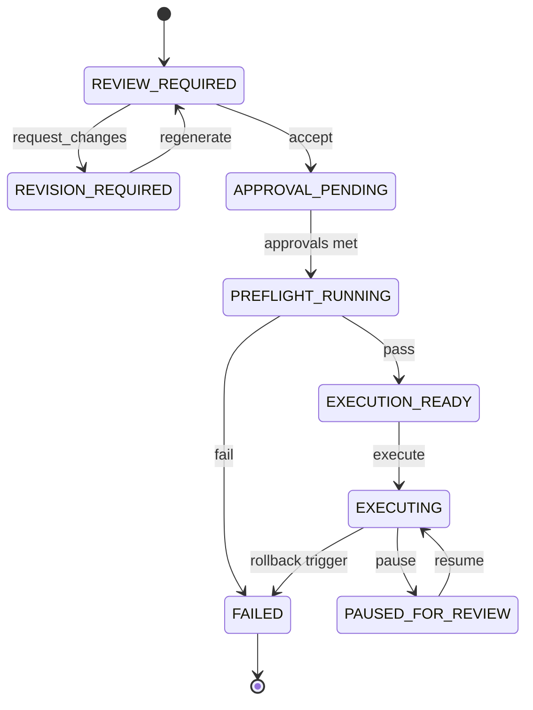

# Stratosphere

Stratosphere is a Kubernetes-first migration architect for legacy enterprise applications.
It interrogates how a VM behaves in real life, explains what it found in plain language, and generates a governed migration package engineers can deploy safely.

Brand promise:
- Interrogate the VM.
- Explain the system.
- Generate the migration plan.

## Non-Technical Overview

If you’ve been running the same application for years and it “just works,” Stratosphere helps you modernize it without guessing.

It studies how your app runs today, creates a map of what exists now, and proposes a safer modern target design for tomorrow.
It then generates a full migration package your technical team can review and deploy.

What this means for app owners:
- You get a clear view of how your application works today.
- You get a clear recommendation for how it should look after modernization.
- You keep your current app running while preparing the new environment (blue/green style).
- A human must approve before any real production cutover.

## Who This Is For (Personas)

- Application Owner (non-technical):
  - Wants modernization without unexpected outages.
  - Needs “today vs tomorrow” clarity and a decision-ready summary.
- Platform / Cloud Engineer:
  - Wants a repeatable package: Dockerfiles, Helm, Terraform, and clear constraints.
  - Needs governance gates and deterministic, reviewable output.
- Security / Risk Reviewer:
  - Wants auditability, explicit approvals, and a safer rebuilt baseline (not VM drift).
- Migration Consultant / Delivery Team:
  - Wants faster discovery and a credible plan without weeks of interviews.

## Product Docs

Start here for full product context:
- `docs/stratosphere/PRODUCT_OVERVIEW.md`
- `docs/stratosphere/DEMO_RUNBOOK.md`
- `docs/stratosphere/ENGINEER_ONBOARDING.md`
- `docs/stratosphere/ENTERPRISE_READINESS.md`
- `docs/stratosphere/EXECUTION_WORKFLOW_SPEC.md`
- `docs/stratosphere/SECURITY_REVIEW.md`
- `docs/stratosphere/INDEX.md`

## Quickstart

```bash
cd /Users/bradfairley/Documents/Playground/stratosphere
npm install
npm run stratosphere -- --runtime-file fixtures/stratosphere/sample-runtime.json --out-dir artifacts/stratosphere
```

Engineer onboarding path:
```bash
npm run build
npm run test:coverage
```

## How It Works (At a Glance)

Stratosphere builds a “current-state” view by observing runtime behavior, then generates a “future-state” Kubernetes plan with governance gates.

```mermaid
flowchart LR
  A["Inputs (runtime + context)"] --> B["Discovery (snapshot/local/ssh)"]
  B --> C["VM DNA graph + evidence"]
  C --> D["Decomposition + recommendations"]
  D --> E["Decision layer (strategy/readiness/impact/ROI)"]
  E --> F["Artifacts (Docker/Helm/Terraform)"]
  F --> G["Review + approval workflow"]
  G --> H["Preflight + execution plan (blue/green)"]
  H --> I["Export to GitHub/GitLab (policy-gated)"]
```



## User Journeys

- App owner journey (15 minutes):
  - Read `reports/executive-summary.md` and compare `reports/application-map-current.md` vs `reports/application-map-future.md`.
  - Review `reports/business-impact.md`, `reports/readiness.md`, and `reports/roi-estimate.md`.
  - Confirm whether unknowns need owners before scheduling a cutover.
- Engineer journey (30-60 minutes):
  - Review artifacts and templates, then validate with `npm run test` and bundle validation tools.
  - Use `reports/cutover-plan.md` for a blue/green checklist and rollback triggers.
  - Use export planning/execution outputs to deliver a PR/MR for review.
- Security reviewer journey:
  - Validate governance gates, audit evidence, and the security baseline notes.
  - Confirm export execution policy and token scopes meet enterprise requirements.

Outputs include Dockerfiles, Helm templates, Terraform scaffolding, VM DNA reports, and blue/green runbook artifacts.
Each run now also includes:
- `reports/application-map-current.md` (how it works today)
- `reports/application-map-future.md` (proposed future architecture map)
- `reports/executive-summary.md` (plain-language migration summary for app owners)
- `reports/runtime-profile-summary.json` (process-level sizing summary)
- `reports/runtime-profile-window.{json,md}` (time-window variance + confidence profile)
- `reports/source-analysis.json` (runtime-to-source component mapping hints)
- `reports/migration-options.{json,md}` (clear strategy expectations and recommendation)
- `reports/readiness.{json,md}` (readiness score, confidence, and scoring graph)
- `reports/roi-estimate.{json,md}` (default ROI model including VM sustainment/security overhead)
- `reports/business-impact.{json,md}` (customer/outage/security/operating effort translation)
- `reports/cutover-plan.{json,md}` (blue/green stages + rollback simulations)
- `reports/glossary.{json,md}` (plain-language infrastructure term guide)
- `reports/executive-pack.{json,md}` (combined decision-layer summary)

## New Flows (Phase 1-3 Kickoff)

### 1) Non-technical owner flow (recommended)

Provide runtime + business intake + application workspace:

```bash
npm run stratosphere -- \
  --runtime-file fixtures/stratosphere/sample-runtime.json \
  --strategy balanced \
  --intake-file fixtures/stratosphere/sample-intake.json \
  --workspace-file fixtures/stratosphere/sample-workspace.json \
  --out-dir artifacts/stratosphere
```

This flow adds:
- `reports/executive-summary.md` for business/stakeholder review.
- `reports/intake.json` and `reports/workspace.json` for context traceability.
- `reports/migration-options.*`, `reports/readiness.*`, `reports/roi-estimate.*`, and `reports/executive-pack.*` for Phase 4 decision support.

Guided wizard option (no JSON prep needed):

```bash
npm run stratosphere -- --wizard --runtime-file fixtures/stratosphere/sample-runtime.json --out-dir artifacts/stratosphere
```

### 2) Local VM discovery flow

```bash
npm run stratosphere -- \
  --local-discovery \
  --intake-file fixtures/stratosphere/sample-intake.json \
  --workspace-file fixtures/stratosphere/sample-workspace.json \
  --out-dir artifacts/stratosphere
```

### 3) Vendor-owned advisory mode

Set `"vendorOwned": true` in intake JSON to force advisory-only blocker output.
This ensures recommendations are reviewed with the software vendor before implementation planning.

## Local VM Discovery (No SSH)

Run Stratosphere directly on the VM and interrogate local runtime state:

```bash
npm run stratosphere -- --local-discovery --out-dir artifacts/stratosphere
```

## Input Modes

- `snapshot`: provide `--runtime-file` JSON
- `local`: provide `--local-discovery` (runs read-only commands on the same VM)
- `ssh`: provide `--ssh-host` + `--ssh-user` (optional `--ssh-port`, `--ssh-key`)
- optional strategy: `--strategy minimal-change|balanced|aggressive-modernization` (default: `balanced`)
- optional business context: `--intake-file fixtures/stratosphere/sample-intake.json`
- optional application scope: `--workspace-file fixtures/stratosphere/sample-workspace.json`

CLI validates conflicting/missing flags and returns structured errors with:
- `code`
- `message`
- `hint`
- `details`

## Validate

```bash
npm run test
npm run test:coverage
```

## Export Planning

```bash
npm run stratosphere -- \
  --runtime-file fixtures/stratosphere/sample-runtime.json \
  --export-provider github \
  --export-owner my-org \
  --export-repo migration-bundle
```

By default export runs in dry-run planning mode and writes `reports/repository-export.json`.

Execution policy (current):
- `export_execute` / `--export-execute` requests execution intent.
- Execution intent is policy-gated:
  - `STRATOSPHERE_ENABLE_EXPORT_EXECUTION=true`
  - provider token env var present (`GITHUB_TOKEN`/`GITLAB_TOKEN` or override via `--export-token-env`)
- Optional:
  - `--export-branch` for branch naming override
  - `--export-target-branch` for PR/MR base branch
  - `--export-auth-mode token|oauth` (default: token)
  - `--export-api-base-url` and `--export-web-base-url` for enterprise provider hosts
  - `--export-token-env` for enterprise secret/env naming alignment
- Export result always reports whether execution was requested, allowed, and executed.

## Workflow Model (Review Before Change)



## MCP Support

Start the MCP server:

```bash
npm run mcp:start
```

Tools exposed:
- `generate_migration_bundle`
- `list_ssh_discovery_commands`
- `generate_local_vm_bundle`
- `validate_migration_bundle`
- `explain_decomposition`
- `init_execution_workflow`
- `review_execution_workflow`
- `approve_execution_workflow`
- `run_execution_preflight`
- `execute_workflow`
- `pause_execution_workflow`
- `rollback_execution_workflow`
- `get_execution_workflow_status`
- `compare_plan_revisions`

### MCP flow with intake + workspace context

When using `generate_migration_bundle` or `generate_local_vm_bundle`, include:
- `strategy` (`minimal-change`, `balanced`, `aggressive-modernization`)
- `intake_file`
- `workspace_file`

These map to the same JSON structures as CLI `--intake-file` and `--workspace-file`.

## Opencode Local VM Use Case

When running on the target VM, register Stratosphere MCP in Opencode as a local stdio server:

```json
{
  "mcpServers": {
    "stratosphere": {
      "command": "npm",
      "args": ["run", "mcp:start"],
      "cwd": "/Users/bradfairley/Documents/Playground/stratosphere"
    }
  }
}
```

Then call `generate_local_vm_bundle` from Opencode to generate artifacts from local runtime state.

## Working Demo

Run the full demo flow end-to-end:

```bash
npm run demo
```

This generates a complete package in `artifacts/stratosphere-demo` and validates required demo artifacts automatically.
