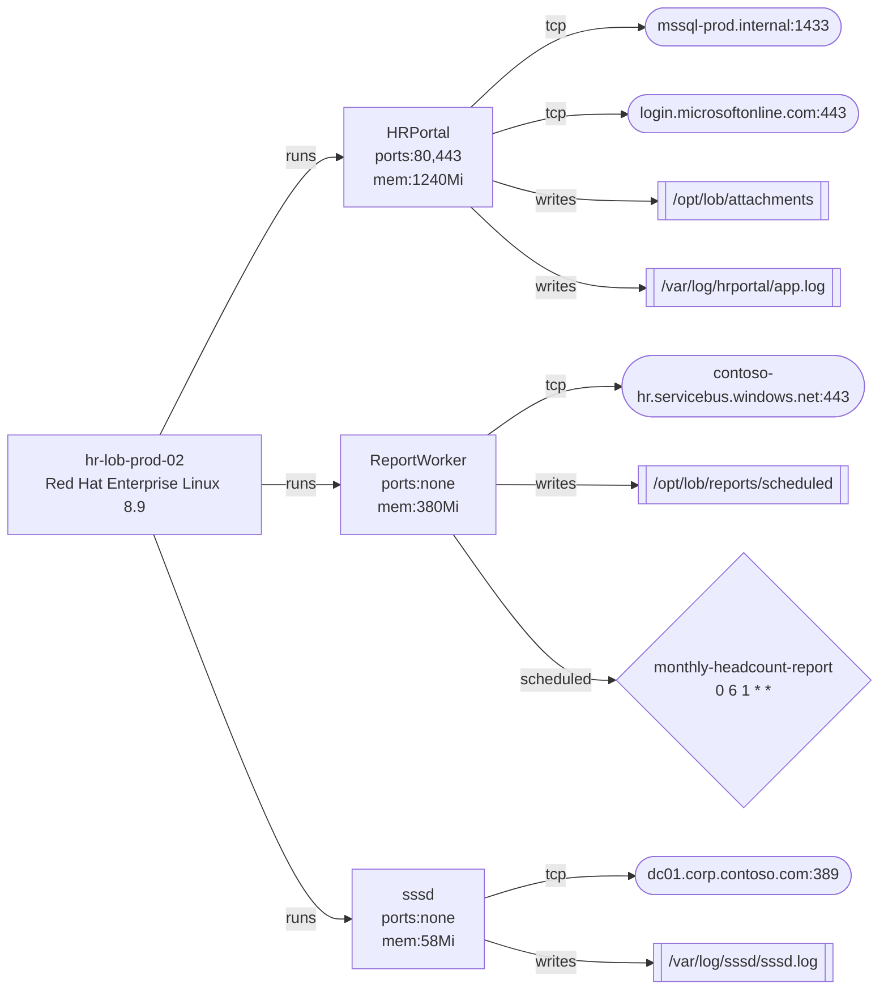

# Current-State Application Map

## Summary

```json
{
  "host": {
    "hostname": "hr-lob-prod-02",
    "os": "linux",
    "distro": "Red Hat Enterprise Linux 8.9",
    "ip": "10.30.7.44"
  },
  "processCount": 3,
  "scheduledJobCount": 1,
  "externalDependencyCount": 4,
  "graph": {
    "nodeCount": 16,
    "edgeCount": 17
  }
}
```

## Diagram


