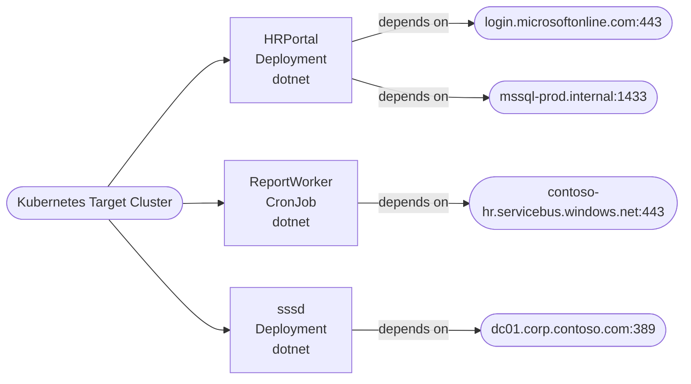

# Future-State Application Map

## Summary

```json
{
  "componentCount": 3,
  "blockers": [
    "Azure Service Bus dependency detected (confidence 0.75). Validate Azure migration approach with vendor documentation before implementation.",
    "Advisory-only mode active due to vendor dependencies. Generated Helm/Terraform artifacts are for planning review only."
  ],
  "byKind": {
    "Deployment": 2,
    "StatefulSet": 0,
    "CronJob": 1
  }
}
```

## Diagram


