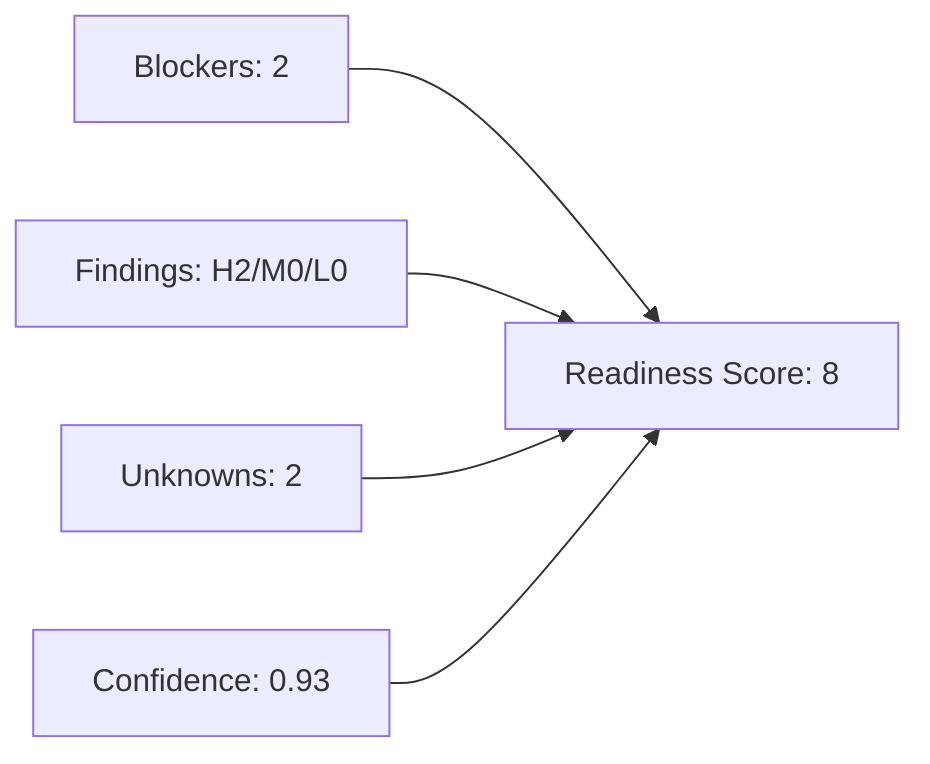

# Readiness Assessment

- Score: 8
- Confidence: 0.71
- Status: NOT_READY
- Unknowns: 2

## Penalty Breakdown
- blockerPenalty: 50
- findingPenalty: 30
- confidencePenalty: 2
- unknownPenalty: 10

## Unknowns
- Business intake not provided.
- Application workspace not provided.

## Scoring Graph

