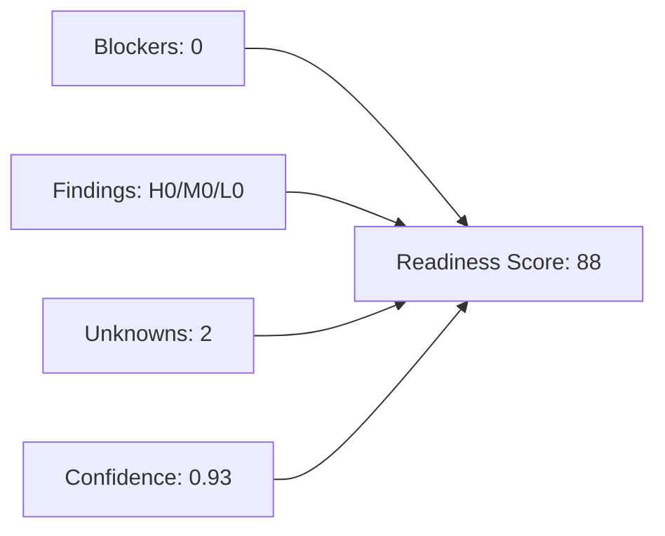

# Readiness Assessment

- Score: 88
- Confidence: 0.87
- Status: READY
- Unknowns: 2

## Penalty Breakdown
- blockerPenalty: 0
- findingPenalty: 0
- confidencePenalty: 2
- unknownPenalty: 10

## Unknowns
- Business intake not provided.
- Application workspace not provided.

## Scoring Graph

