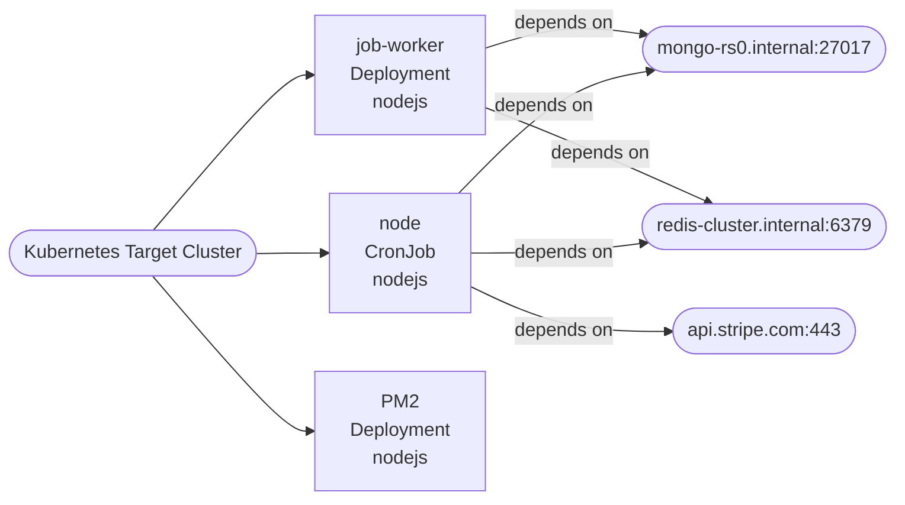

# Future-State Application Map

## Summary

```json
{
  "componentCount": 3,
  "blockers": [
    "node: both persistent writes and scheduled execution detected; verify workload split."
  ],
  "byKind": {
    "Deployment": 2,
    "StatefulSet": 0,
    "CronJob": 1
  }
}
```

## Diagram


