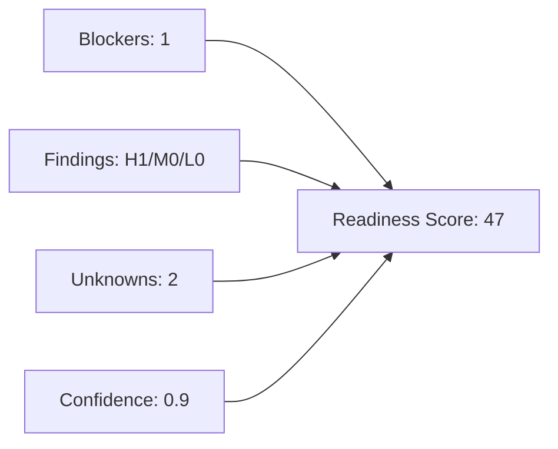

# Readiness Assessment

- Score: 47
- Confidence: 0.79
- Status: NOT_READY
- Unknowns: 2

## Penalty Breakdown
- blockerPenalty: 25
- findingPenalty: 15
- confidencePenalty: 3
- unknownPenalty: 10

## Unknowns
- Business intake not provided.
- Application workspace not provided.

## Scoring Graph

